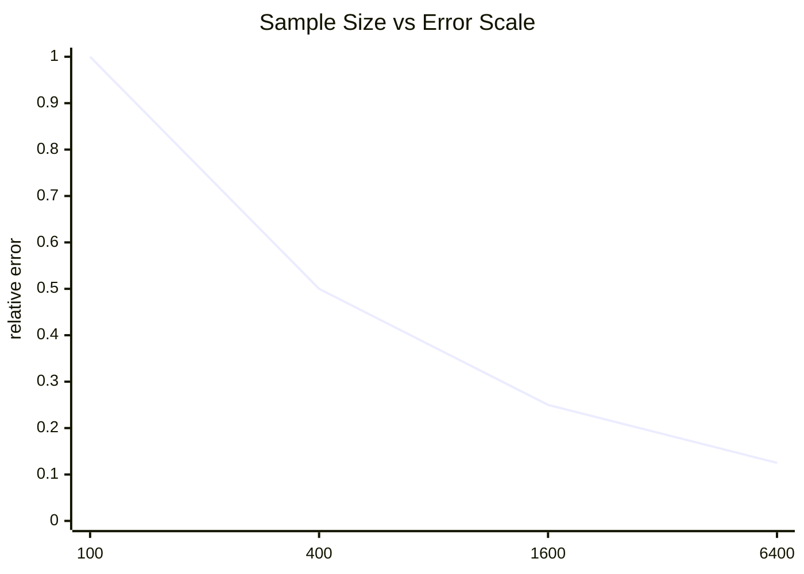
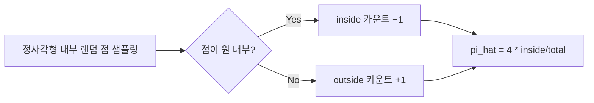
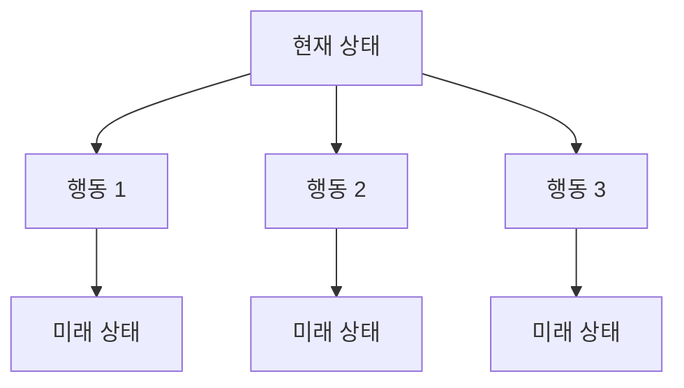
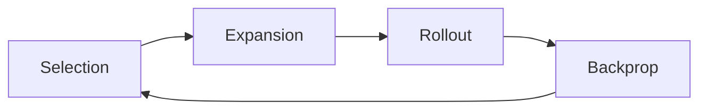
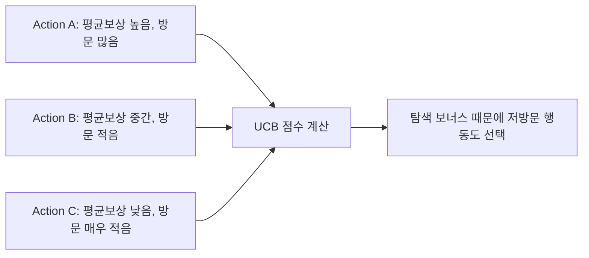
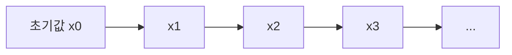
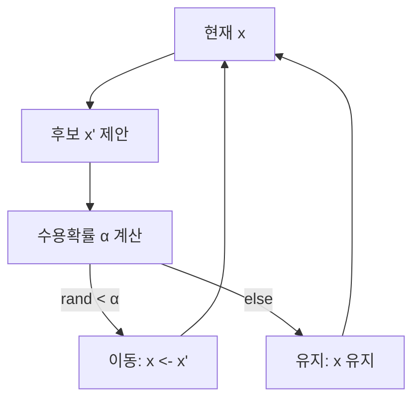
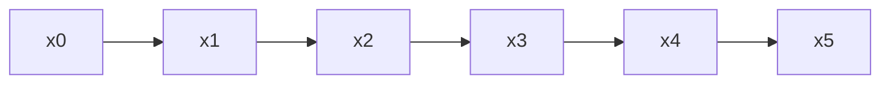
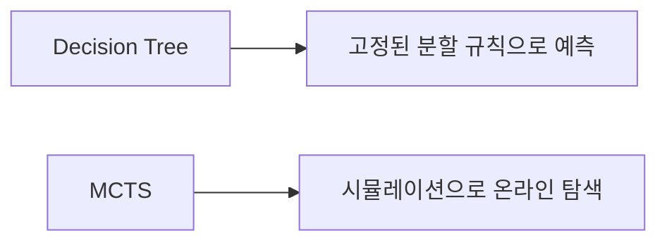
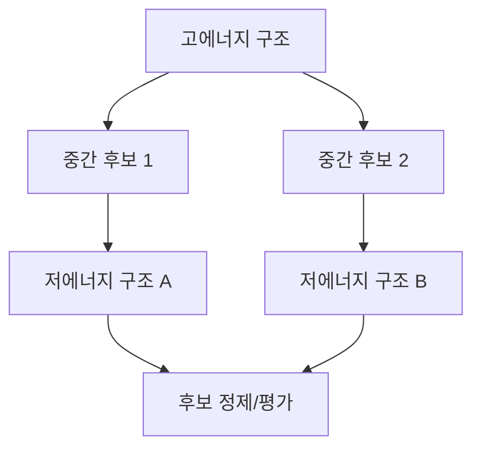

# Week 7 · Monte Carlo, MCTS, MCMC

---

## Slide 1 — 오늘 목표 (2시간)

- Monte Carlo 방법의 핵심 원리 이해
- MCTS(Monte Carlo Tree Search) 작동 방식 이해
- MCMC(Markov Chain Monte Carlo) 작동 방식 이해
- MCTS와 MCMC의 공통점/차이점 정리
- Decision Tree와의 관계 정리
- AlphaFold 맥락에서 “샘플링/탐색” 아이디어 연결

**권장 시간 배분**
- 이론 75분
- 코드/실습 35분
- Q&A 10분
- 휴식은 Q&A 시간에 포함시키거나 별도 5분 버퍼로 조정

---

## Slide 2 — 왜 Monte Carlo를 배우는가?

직접 계산이 어려운 문제들이 많습니다.

- 차원이 높아질수록 적분이 급격히 어려워짐
- 상태 공간이 큰 의사결정 문제는 완전탐색 불가능
- 확률적 시스템은 단일 정답보다 분포적 해석이 중요

> Monte Carlo 계열은 “정확한 닫힌형 해” 대신 “통계적으로 신뢰 가능한 근사”를 제공합니다.

---

## Slide 3 — Monte Carlo 한 줄 정의 + 직관 그림

> **무작위 샘플링으로 복잡한 값을 근사하는 계산 방법**


핵심 포인트:
1. 샘플 생성 규칙이 명확해야 함
2. 샘플 수와 분산이 정확도를 결정함

---

## Slide 4 — 오차 스케일: 1/sqrt(N)

```text
표준오차(standard error) ≈ σ / sqrt(N)
```

- 샘플을 4배 늘려야 오차가 약 1/2로 감소
- 샘플을 100배 늘려도 오차는 약 1/10 감소
- 따라서 **분산 감소 기법**(importance sampling 등)이 실무에서 중요

### 시각 직관 (N 증가 vs 오차)



---

## Slide 5 — 예시: 원주율(π) 추정

정사각형 `[-1,1]×[-1,1]` 안에서 점을 랜덤으로 뽑으면,

```text
π ≈ 4 × (원 내부 점 수 / 전체 점 수)
```

### 기하 그림



해석:
- 점 개수가 늘수록 원 비율이 안정화
- 수렴은 되지만 속도는 느린 편

---

## Slide 6 — MCTS는 어떤 문제를 푸는가?

MCTS = **Monte Carlo + Tree Search**

- 목적: 큰 의사결정 트리에서 유망한 행동 찾기
- 전체 트리를 다 보지 않고도 좋은 수를 선택
- 게임 AI, 계획 수립, 시뮬레이션 기반 제어에 강함



---

## Slide 7 — MCTS 4단계 루프 그림

1. **Selection**: UCB 기준으로 내려감
2. **Expansion**: 새 노드 1개 확장
3. **Simulation**: rollout으로 끝까지 플레이
4. **Backpropagation**: 보상 역전파



---

## Slide 8 — UCB 수식과 의미

```text
UCB = Q/N + c * sqrt(ln(N_parent)/N)
```

- `Q/N`: 지금까지 평균 성과 (활용, exploitation)
- `sqrt(...)`: 덜 본 노드 보너스 (탐색, exploration)
- `c`: 탐색 성향 하이퍼파라미터

### 그림으로 보기



---

## Slide 9 — MCMC는 어떤 문제를 푸는가?

MCMC = **복잡한 확률분포에서 샘플을 뽑는 기술**

- 직접 샘플링 불가능한 분포 `p(x)`에서 샘플 획득
- 베이지안 추론의 사후분포 계산에 핵심
- 정규화 상수를 몰라도(비례식만 알아도) 가능한 경우가 많음



---

## Slide 10 — Metropolis-Hastings 단계 그림

1. 현재 상태 `x`
2. 제안분포에서 후보 `x'` 생성
3. 수용확률 `α = min(1, p(x')/p(x))` 계산(대칭 제안 가정)
4. 확률 `α`로 이동, 아니면 유지



### 직관 그림



수용되면 다음 상태로 이동하고, 거절되면 같은 상태가 반복되어 체인이 형성됩니다.

---

## Slide 11 — MCTS vs MCMC 비교표

| 항목 | MCTS | MCMC |
|------|------|------|
| 주 대상 | 의사결정 트리 | 확률분포 |
| 목표 | 최선 행동 선택 | 분포 샘플 생성 |
| 핵심 아이디어 | 선택 편향 탐색 | 마코프 연쇄 수렴 |
| 결과물 | 행동 가치/정책 | 샘플 집합 |
| 대표 활용 | 게임 AI, planning | 베이지안 추론, 통계물리 |

공통점:
- 샘플 기반 근사
- 계산량-정확도 트레이드오프가 핵심

---

## Slide 12 — Decision Tree와의 관계 (오해 정리)

- **Decision Tree**: 데이터로 학습된 분할 규칙 모델
- **MCTS**: 탐색 과정에서 동적으로 트리를 성장시키는 알고리즘



핵심:
- 둘 다 트리를 쓰지만, “학습 모델”과 “탐색 알고리즘”은 다름

---

## Slide 13 — AlphaFold 맥락 연결

1. AlphaFold2 핵심 추론 자체는 MCTS/MCMC가 아님
2. 그러나 구조생물학 워크플로우 전반에는 샘플링 사고가 중요
3. 구조 정제/도킹/에너지 landscape 탐색에서 MC/MCMC 계열이 활용됨
4. 연구 실무에서는 “예측 + 샘플링 + 탐색”의 결합이 자주 등장

### 구조 탐색 직관 이미지



---

## Slide 14 — Hands-on 안내

실습 1: Monte Carlo π 추정 (샘플 수와 오차)
- `N`을 바꿔 오차 감소율 확인

실습 2: MCMC 샘플링
- `step_std`에 따른 acceptance rate / mixing 비교

실습 3: MCTS 게임 탐색
- `c` 값에 따른 탐색 행동 변화 분석

---

## Slide 15 — 요약

- Monte Carlo: 랜덤 샘플 기반 근사 계산
- MCTS: 트리에서 유망 행동을 찾는 샘플링 탐색
- MCMC: 복잡한 분포를 따르는 샘플 생성
- 세 방법 모두 “완전 계산 대신 확률적 근사”라는 공통 철학 보유
- 실무에서는 문제 구조에 맞춰 조합해 사용
